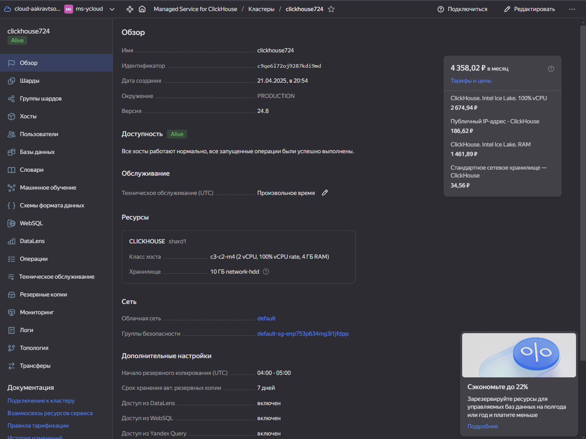

# Yandex Cloud Homework

## Задание 1 (Hadoop + Hive)

1. Фильтрация «хороших» валют c подсчетом суммы
```sql
SELECT 
    currency,
    SUM(amount) AS total_amount
FROM 
    transactions_v2
WHERE 
    currency IN ('USD', 'EUR', 'RUB')
GROUP BY 
    currency;
```

2. Подсчёт количества мошеннических (is_fraud=1) и нормальных (is_fraud=0) транзакций, суммарной суммы и среднего чека
```sql
SELECT 
    is_fraud,
    COUNT(*) AS transaction_count,
    SUM(amount) AS total_amount,
    AVG(amount) AS average_amount
FROM 
    transactions_v2
GROUP BY 
    is_fraud;
```

3. Группировка по датам с вычислением ежедневного количества транзакций, суммарного объёма и среднего amount.
```sql
SELECT 
    DATE(transaction_date) AS transaction_day,
    COUNT(*) AS transaction_count,
    SUM(amount) AS total_amount,
    AVG(amount) AS average_amount
FROM 
    transactions_v2
GROUP BY 
    DATE(transaction_date)
ORDER BY 
    transaction_day;
```

4. Использование временных функций (например, извлечение дня/месяца из transaction_date) и анализ транзакций по временным интервалам.
```sql
SELECT 
    YEAR(transaction_date) AS year,
    MONTH(transaction_date) AS month,
    DAY(transaction_date) AS day,
    HOUR(transaction_date) AS hour,
    COUNT(*) AS transaction_count,
    SUM(amount) AS total_amount
FROM 
    transactions_v2
GROUP BY 
    YEAR(transaction_date),
    MONTH(transaction_date),
    DAY(transaction_date),
    HOUR(transaction_date)
ORDER BY 
    year, month, day, hour;
```

5. JOIN с таблицей logs_v2 по transaction_id, чтобы посчитать количество логов на одну транзакцию, выделить самые частые категории category 
```sql
-- Подсчет логов для транзакции и поиск наиболее частых категорий
SELECT 
    t.transaction_id,
    COUNT(l.log_id) AS log_count,
    COLLECT_LIST(DISTINCT l.category) AS categories,
    COUNT(DISTINCT l.category) AS unique_categories
FROM 
    transactions_v2 t
LEFT JOIN 
    logs_v2 l ON t.transaction_id = l.transaction_id
GROUP BY 
    t.transaction_id
ORDER BY 
    log_count DESC;

-- Просто самыe частые категории
SELECT 
    l.category,
    COUNT(*) AS category_count
FROM 
    transactions_v2 t
JOIN 
    logs_v2 l ON t.transaction_id = l.transaction_id
GROUP BY 
    l.category
ORDER BY 
    category_count DESC;
```

## Задание 2 (Clickhouse)

1. Группировка по payment_status: подсчитываем количество заказов, сумму (total_amount), среднюю стоимость заказа
```sql
SELECT 
    payment_status,
    COUNT(*) AS order_count,
    SUM(total_amount) AS total_amount_sum,
    AVG(total_amount) AS avg_order_amount
FROM orders
GROUP BY payment_status
ORDER BY order_count DESC;
```

2. JOIN с order_items: подсчитать общее количество товаров, общую сумму, среднюю цену за продукт
```sql
SELECT 
    o.order_id,
    COUNT(oi.item_id) AS total_items,
    SUM(oi.product_price * oi.quantity) AS total_order_value,
    AVG(oi.product_price) AS avg_product_price
FROM orders o
JOIN order_items oi ON o.order_id = oi.order_id
WHERE o.payment_status != 'cancelled'
GROUP BY o.order_id
ORDER BY total_order_value DESC;
```

3. Отдельно посмотреть статистику по датам (количество заказов и их суммарная стоимость за каждый день).
```sql
SELECT 
    toDate(order_date) AS order_day,
    COUNT(*) AS order_count,
    SUM(total_amount) AS daily_total_amount
FROM orders
WHERE payment_status != 'cancelled' 
GROUP BY order_day
ORDER BY order_day;
```

4. Выделить «самых активных» пользователей (по сумме заказов или по количеству заказов).
```sql
-- По сумме заказов
SELECT 
    user_id,
    COUNT(*) AS order_count,
    SUM(total_amount) AS total_spent
FROM orders
WHERE payment_status = 'paid'
GROUP BY user_id
ORDER BY total_spent DESC
LIMIT 5;

-- По количеству заказов
SELECT 
    user_id,
    COUNT(*) AS order_count,
    SUM(total_amount) AS total_spent
FROM orders
WHERE payment_status = 'paid'
GROUP BY user_id
ORDER BY order_count DESC
LIMIT 5;
```

## Задание 3 (Дашборд)
[Ссылка на дашборд](https://datalens.yandex/t3aunwl943nuf)

> Будет недоступен с тех пор, как я дропну каталог во имя сохранения квоты


## Скриншоты созданного каталога облачных сервисов



